# ¿Qué es GitHub Education?

Una buena práctica al investigar un sistema nuevo consiste en estudiar primero su documentación. Como fuente principal, lo más lógico y razonable es utilizar la documentación del propio GitHub, en lugar de artículos de terceros o resúmenes.

GitHub Education ofrece a estudiantes y docentes acceso a los recursos educativos de GitHub. Para los estudiantes existe un procedimiento de verificación de su situación académica, tras el cual se habilitan las ventajas y ofertas correspondientes.

Según la información de GitHub, el estudiante debe estar matriculado en un programa que conduzca a la obtención de un título u otra acreditación académica, tener una cuenta personal de GitHub, cumplir los requisitos de edad y demostrar que actualmente es estudiante. Como justificante pueden servir, por ejemplo, un documento de estudiante vigente, un horario de clases, un transcript o una confirmación oficial de matrícula. En algunos casos también se utiliza un email académico verificado.

## Ventajas de GitHub Education

GitHub ofrece una serie de recursos educativos a los estudiantes verificados. Entre las ventajas indicadas en la página se encuentran GitHub Copilot, 180 horas mensuales de Codespaces, las posibilidades de GitHub Pro o Team, incluidos los repositorios privados ilimitados, así como Student Developer Pack con ofertas de diferentes colaboradores. El contenido concreto de Student Developer Pack puede cambiar con el tiempo.

A primera vista, el procedimiento para presentar la solicitud parece muy corto:

_Education benefits settings → Start an application → rellenar el formulario → Submit application_

Por eso, al comenzar la investigación supuse que la mayor parte del trabajo consistiría en estudiar los requisitos y las ventajas de GitHub Education, mientras que la parte práctica sería relativamente sencilla.

Como demostró el experimento, esta hipótesis era demasiado optimista.

# Parte práctica: proceso de solicitud

### 1. Preparación de la cuenta

Antes de comenzar la solicitud decidí revisar los datos de mi cuenta de GitHub, que ya tenía anteriormente. Partí de la suposición de que, para verificar la situación académica, era importante que el perfil estuviera correctamente cumplimentado.

Después de revisarlo, consideré que la cuenta estaba suficientemente preparada y pasé a GitHub Education.

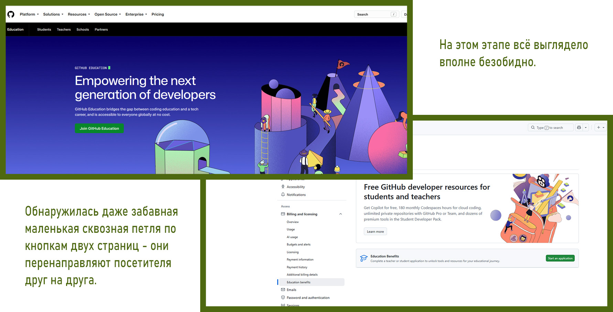

### 2. Inicio de la solicitud y primera sorpresa

Elegí el rol "Student". GitHub detectó el email académico verificado, pero, inesperadamente, por su dominio lo relacionó con Green Isle High School, que no tiene ninguna relación con mi centro educativo.

Por eso no seleccioné la opción propuesta e intenté indicar manualmente mi centro educativo: C.P.I.F.P. Alan Turing.

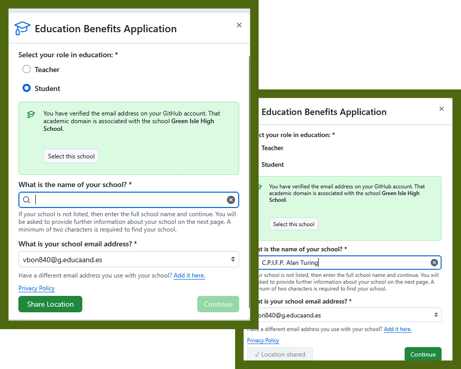

Al principio, el centro correcto no aparecía en la lista. Sin embargo, el propio formulario explicaba qué hacer en esta situación:

> _If your school is not listed, then enter the full school name and continue._

Después de compartir la geolocalización, el botón para continuar se activó y pude seguir adelante.

### 3. Información adicional sobre el centro educativo

La siguiente pantalla solicitaba información más detallada.

Había que indicar la página web del centro educativo, el formato de los emails académicos de profesores y estudiantes, el tipo de institución, el número aproximado de estudiantes y su dirección.

Algunas preguntas no resultaron del todo evidentes. Por ejemplo, la formulación "What academic email does your school provide to teachers?" al principio parecía pedir el email de un profesor concreto. En realidad, se solicitaba el formato de las direcciones académicas. La mayoría de los profesores que aparecían en los materiales que yo tenía utilizaban el dominio "@g.educaand.es".

También surgió una duda sobre la clasificación del centro educativo. Como estudio un "Grado Superior", en el formulario elegí la opción "Higher-education: university, college".

No intenté calcular por mi cuenta el número de estudiantes sumando los diferentes ciclos. En la página web del centro se indicaba que había aproximadamente 450 estudiantes, por lo que elegí el intervalo correspondiente.

### 4. Primer 404

Después de completar la información sobre el centro educativo, pulsé "Continue" y, en lugar de llegar al siguiente paso, obtuve:

**404 — This is not the web page you are looking for.**

Mi primera hipótesis fue que quizá se trataba de una forma peculiar de comunicar que GitHub no aceptaba un centro educativo que no reconocía.

Sin embargo, esto no encajaba bien con la propia lógica del formulario. GitHub permitía indicar manualmente un centro que no aparecía en su lista y después solicitaba su página web, los dominios académicos, el tipo de institución, el número de estudiantes y su dirección. Por tanto, el hecho de que el centro no apareciera inicialmente en la lista no debería ser, por sí solo, motivo para interrumpir el proceso.

Volví al principio.

A esas alturas, la formulación de la tarea «si has conseguido que acepten tu cuenta» ya empezaba a parecerme algo más inquietante.

Como QA, no podía dejar un 404 sin hacer mentalmente un bug report:

**Precondition:** verified academic email, Student selected.  
**Steps:** Start an application → вручную указать отсутствующее учебное заведение → заполнить дополнительные сведения → Continue.  
**Actual result:** redirect to `/settings/education/developer_pack_applications` → HTTP 404.  
**Expected result:** следующий этап application workflow.

Después de volver a abrir Education Benefits, no aparecía ninguna solicitud activa: el botón "Start an application" volvía a estar disponible.

### 5. Primera causa real encontrada: 2FA

En el siguiente intento, el formulario por fin dio una pista más útil: para el centro educativo seleccionado era necesario activar **la autenticación de dos factores (2FA)**.

Conocía la existencia de 2FA en GitHub, pero antes de comenzar la solicitud no recordé que fuera necesario configurarla.

Después de configurar Authenticator, volví a la solicitud.

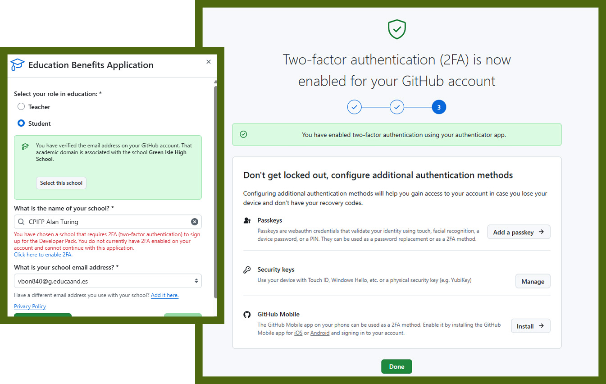

En ese momento recordé una de las preguntas de un cuestionario reciente de clase: _¿qué hago si una tarea resulta más difícil de lo que esperaba?_ Entre las posibles respuestas estaba: _«la abandono y me dedico a otra cosa»_.

No. Yo no abandono las tareas difíciles. A veces quizá no sea la estrategia más económica. Pero en este caso tampoco había alternativa: había que completar la tarea.

### 6. Verificación de la condición de estudiante

Después de configurar 2FA, por primera vez conseguí superar la barrera anterior y llegué a la verdadera fase de verificación de la situación académica.

GitHub propuso elegir el tipo de documento:

_"Please select the type of academic enrollment proof you would like to provide."_

El problema era que la mayoría de mis documentos existían en formato electrónico y no tenía a mano ningún documento evidente que confirmara una matrícula ya formalizada.

Encontré un documento que contenía mi nombre, el nombre del centro educativo y datos relacionados con mis estudios, y decidí intentar utilizarlo.

### 7. La cámara

Aquí comenzó una parte inesperada del experimento.

En lugar de permitir la carga normal de un PDF, la interfaz proponía mostrar el documento a la cámara. Pero mi documento era electrónico y, precisamente en ese momento, la impresora se había quedado sin tinta.

Así que mi primera instalación experimental quedó de la siguiente manera:

_**portátil + cámara integrada + segundo monitor con el documento abierto.**_

El resultado fue aproximadamente el que cabía esperar.

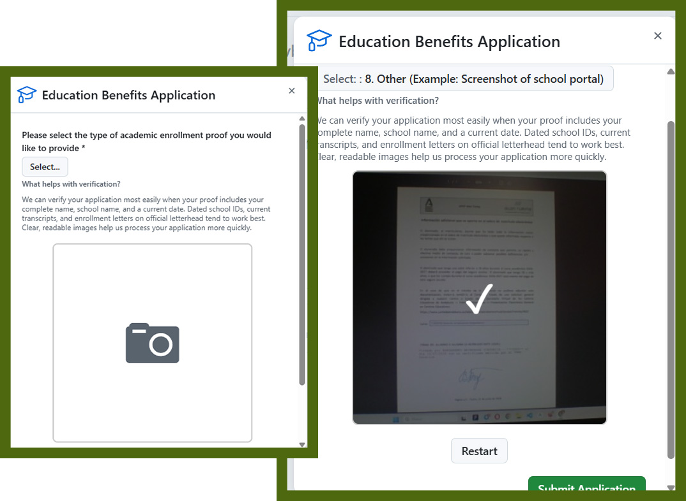

El texto resultó poco legible.

Y entonces volvió a aparecer un personaje ya conocido de esta investigación:

**404**.

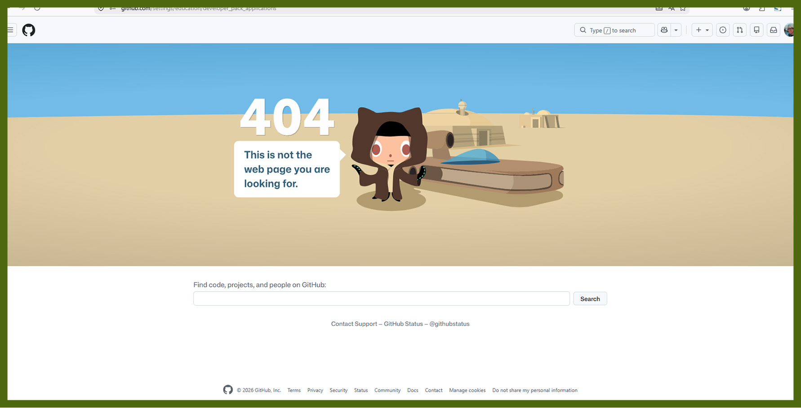

### 8. Nuevos intentos

Volví a iniciar el procedimiento e intenté mostrar a la cámara una parte más grande del documento para que el texto pudiera leerse.

Al mismo tiempo pregunté a mis compañeros por su experiencia. Me dijeron que el profesor había advertido que quizá sería necesario presentar la solicitud varias veces.

Entendido. Continúo.

Probé con otro documento justificativo y finalmente apareció un estado que parecía mucho más prometedor:

**Pending.**

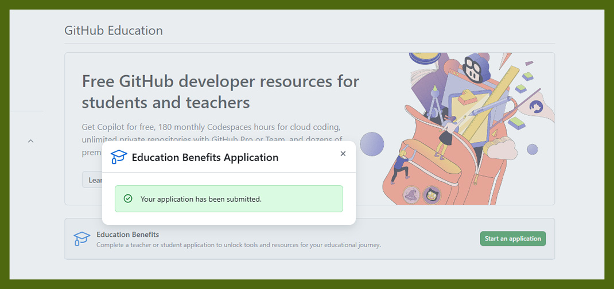

Durante unos minutos pensé que el quest estaba prácticamente terminado.

Fue una conclusión prematura.

### 9. Rejected — pero por fin con diagnóstico

Unos minutos después, la solicitud pasó al estado **Rejected**.

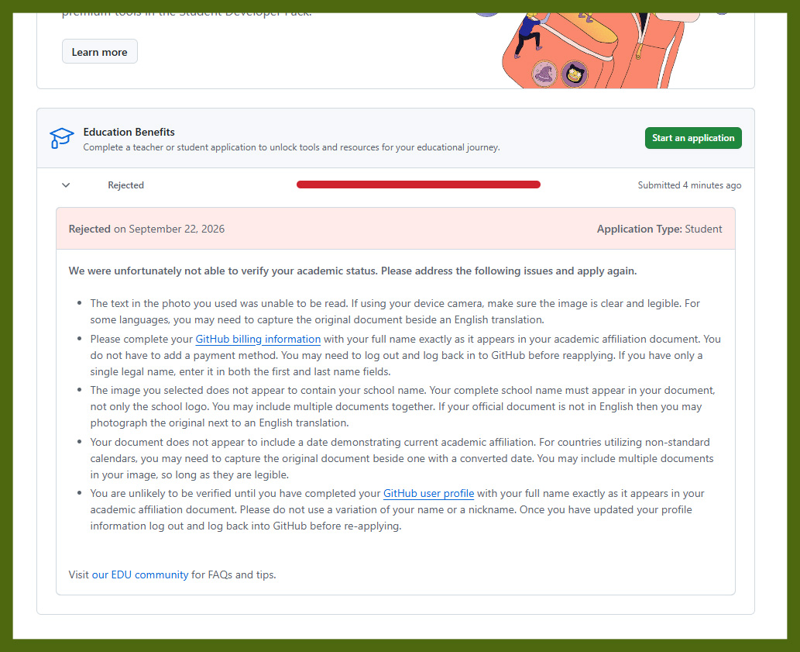

Sin embargo, este rechazo fue el primero realmente útil. En lugar del misterioso 404, GitHub mostró una lista de problemas concretos y propuso explícitamente corregirlos y volver a presentar la solicitud.

Entre los problemas detectados estaban:

- era necesario completar GitHub billing information;
- la fotografía del documento no era suficientemente legible;
- no se había podido reconocer con seguridad el nombre completo del centro educativo;
- no se había podido identificar una fecha que demostrara la situación académica actual;
- el nombre de los documentos, Billing information y el perfil de GitHub debía coincidir.

Por primera vez, la tarea dejó de ser una investigación sobre el comportamiento misterioso del sistema y se convirtió en un procedimiento normal de corrección de condiciones conocidas.

### 10. Billing Information y el unicornio

Pasé a completar Billing information, ajusté los datos para que coincidieran con mi nombre oficial y guardé los cambios.

GitHub respondió con un unicornio.

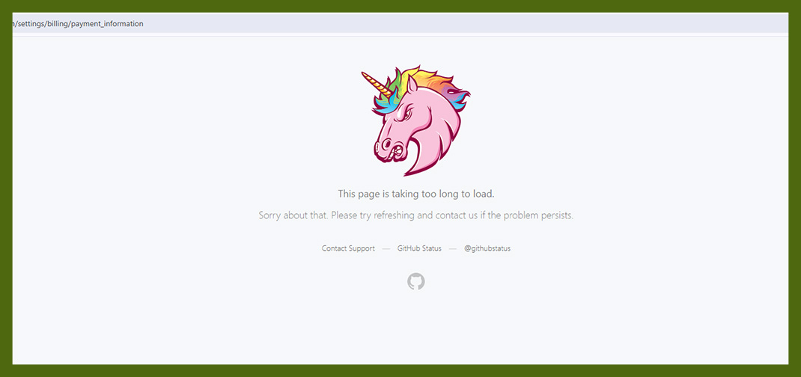

La página no terminó de cargar y mostró un mensaje de timeout. Más tarde comprobé que los datos sí se habían guardado.

Para el procedimiento oficial, este episodio resultó prácticamente inútil. Para la historia documental de la investigación, era demasiado bonito como para eliminarlo.

En este punto empecé a sospechar que GitHub Education había sido desarrollado conjuntamente con profesores de centros educativos con el objetivo específico de entrenar la perseverancia de los estudiantes. Me imaginé unas negociaciones:

**Profesor:** «Hay que investigar GitHub Education. Y sí, habrá que intentarlo muchas veces».
**GitHub:** «Entendido. ¿Qué nivel de dificultad?»
**Profesor:**«Primero de DAM».
**GitHub:** «Recibido. Iniciando `Dark Souls: Education Edition`.»

### 11. Búsqueda de un documento justificativo adecuado

Volví a revisar mi perfil de GitHub e intenté averiguar si podía obtener un justificante adecuado a través de iPasen.

Allí no apareció ningún documento. En cambio, de manera completamente accidental descubrí cómo cambiar la foto de perfil, algo que anteriormente no había conseguido hacer.

Así quedó completado inesperadamente el quest secundario «cambiar la foto en iPasen». No era el achievement que había venido a buscar, pero también era un resultado.

Después de otro intento fallido decidí abandonar los experimentos con imágenes de documentos electrónicos y solicitar a la secretaría del centro un certificado oficial de que estaba estudiando allí.

Conseguirlo resultó mucho más sencillo que superar las fases anteriores: bastó con escribir un email a secretaría.

El siguiente rechazo ya lo recibí así: "Ah... ¿De verdad? Bueno..."

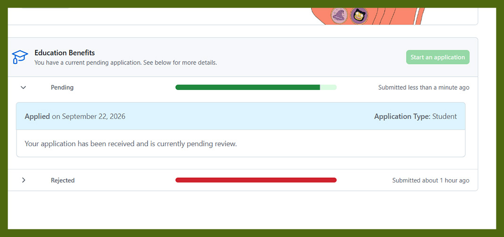

### 12. Último intento

Después de obtener una impresión de buena calidad del documento oficial, hice una nueva fotografía. Esta vez utilicé el teléfono para conseguir una imagen más clara y luminosa.

Además, después de modificar los datos de la cuenta hice logout/login, tal como recomendaba GitHub.

La solicitud volvió a pasar al estado de espera.

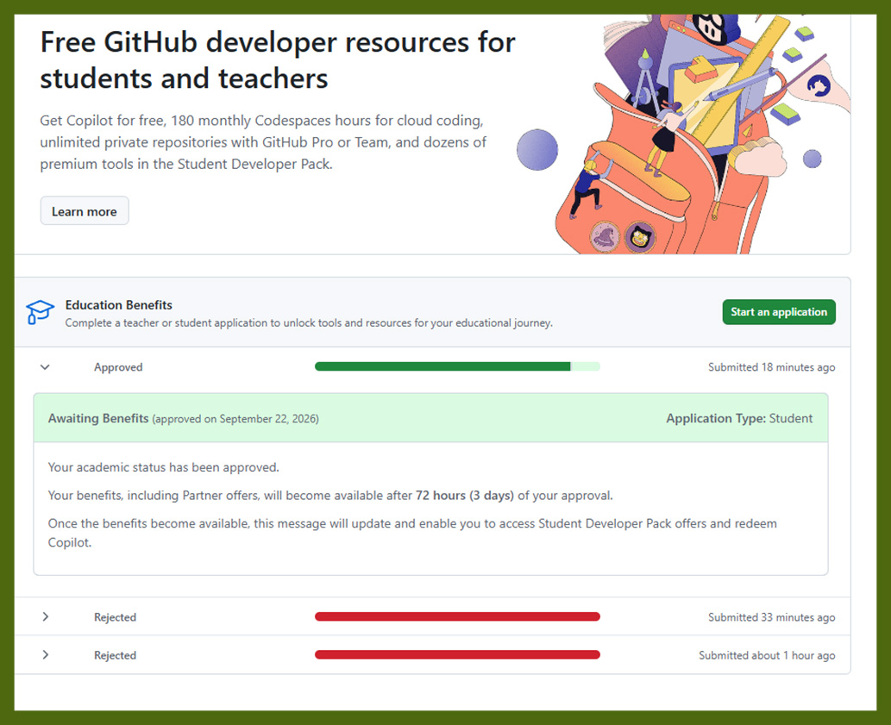

Después de los dos rechazos anteriores, ya esperaba casi automáticamente un tercero.

Pero esta vez ocurrió algo diferente.

### 13. Approved

GitHub mostró:

**Approved**

y el mensaje:

**Your academic status has been approved.**

Después de varios intentos, dos rechazos, dos 404, la configuración de 2FA, completar Billing information, revisar el perfil, un unicornio, buscar un documento y realizar varios experimentos con la cámara, finalmente quedó verificada mi situación académica.

Curiosamente, después de toda la secuencia anterior de errores, mi primera reacción al ver "Approved" no fue «¡terminado!», sino sospechar que el sistema todavía estaba esperando algo.

Con esto, el experimento puede darse por finalizado.

## Conclusiones

La investigación comenzó con la suposición de que bastaría con abrir GitHub Education, rellenar un formulario corto y confirmar la condición de estudiante. En la práctica, el proceso resultó considerablemente más interesante.

Para mí, el principal resultado ni siquiera consiste en haber obtenido el estado de GitHub Education. Este experimento se convirtió en un pequeño ejercicio práctico de resolución iterativa de problemas.

Cuando un sistema no hace lo esperado, resulta útil no repetir a ciegas la misma acción, sino registrar el estado actual, leer los mensajes de error, formular una hipótesis, modificar una condición concreta y comprobar el resultado. Si la información disponible no es suficiente, hay que buscar una fuente adicional u obtener nuevos datos.

En la práctica, todo el proceso puede representarse como un ciclo:

**observación → hipótesis → cambio → comprobación → nuevo resultado → siguiente hipótesis.**

De este modo, el 404 inicialmente inquietante se convirtió poco a poco en problemas diagnosticables, después en un conjunto de correcciones concretas y, finalmente, en "Approved".

La investigación también demostró que sigue siendo más útil leer atentamente la documentación **antes** de comenzar el experimento, y no después.

Aunque, en ese caso, probablemente la investigación habría resultado mucho menos interesante.

### Anexo: GitHub Education Quest

Como reconstrucción visual resumida del recorrido realizado, preparé el siguiente esquema:

**GitHub Education Quest — Full Walkthrough Including DLC**

Está basado en la secuencia real de intentos, errores, correcciones y desvíos inesperados que surgieron durante la realización de la tarea.

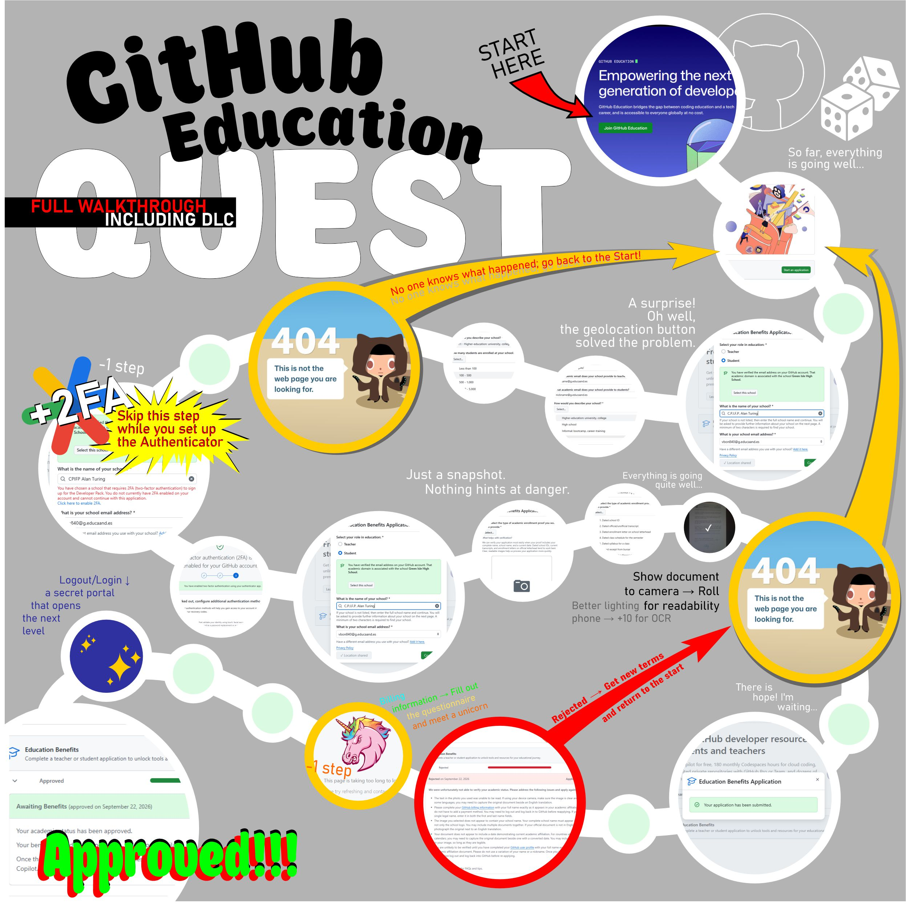
