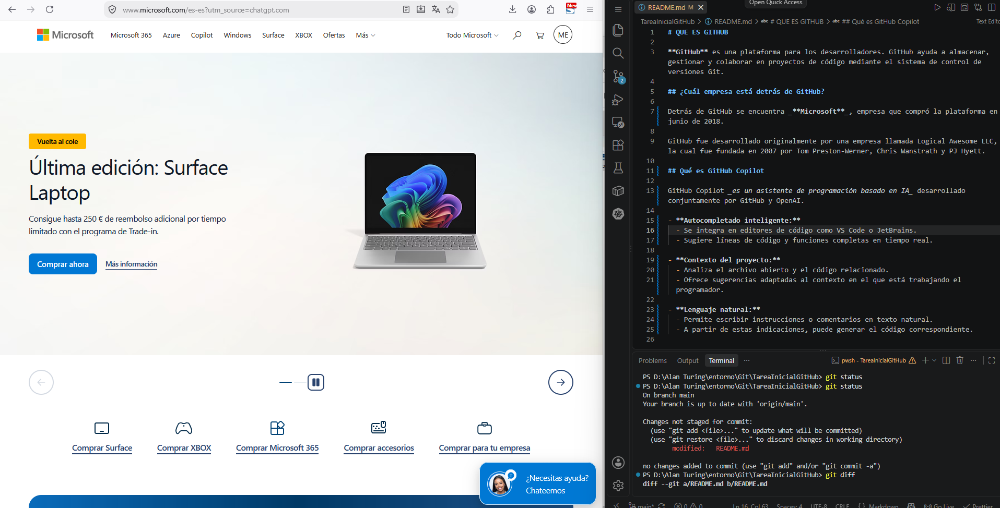

# ¿QUE ES GITHUB?

**GitHub** es una plataforma para los desarrolladores. GitHub ayuda a almacenar, gestionar y colaborar en proyectos de código mediante el sistema de control de versiones Git.

## ¿Cuál empresa está detrás de GitHub?

Detrás de GitHub se encuentra _**Microsoft**_, empresa que anunció la adquisición de GitHub en junio de 2018 y completó la compra en octubre del mismo año.
GitHub comenzó como un proyecto desarrollado por Tom Preston-Werner y Chris Wanstrath, al que posteriormente se incorporó PJ Hyett. La plataforma se lanzó oficialmente en 2008.

### Página oficial de Microsoft

La siguiente captura muestra la página web oficial de **Microsoft**, empresa propietaria de GitHub. En la captura también se muestra el entorno utilizado para realizar esta tarea.

## ¿Qué es GitHub Copilot?

GitHub Copilot _es un asistente de programación basado en IA_ que ayuda a los desarrolladores a escribir, comprender y modificar código.

- **Autocompletado inteligente:**
  - Se integra en editores de código como VS Code o JetBrains.
  - Sugiere líneas de código y funciones completas en tiempo real.
- **Contexto del proyecto:**
  - Analiza el archivo abierto y el código relacionado.
  - Ofrece sugerencias adaptadas al contexto en el que está trabajando el programador.
- **Lenguaje natural:**
  - Permite escribir instrucciones o comentarios en texto natural.
  - A partir de estas indicaciones, puede generar el código correspondiente.
